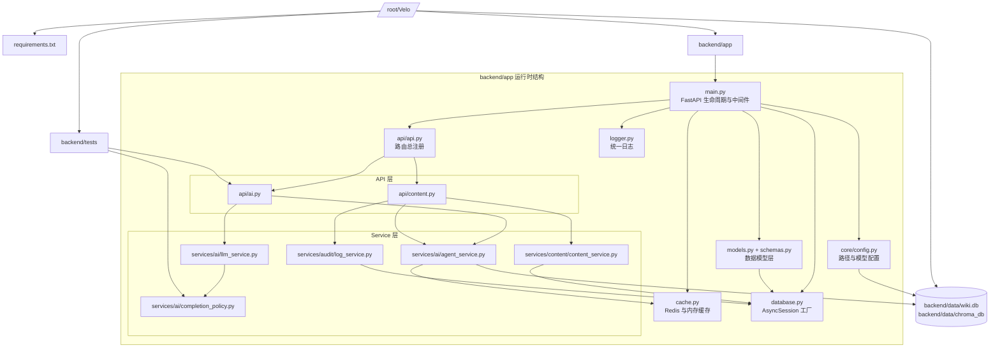

# Backend目录与存储规范

## 1. 调整结论

本轮 `backend` 的边界已经重新定死，原则只有三条：运行时代码留在 `backend/app`，正式数据留在 `backend/data`，依赖定义提升到仓库根目录统一维护。

本次整理后的明确结论：

- 完全放弃 Docker，删除 `backend/Dockerfile`、`backend/entrypoint.sh`，不再维护容器化链路。
- Python 依赖统一放在仓库根目录 `/root/Velo/requirements.txt`，不再在 `backend/` 内保留第二份。
- 正式持久化目录仍然只有 `backend/data/wiki.db` 和 `backend/data/chroma_db/`。
- 保留 `backend/tests`，因为它仍然覆盖补全策略和 `/completion` API；本轮已在项目虚拟环境内验证通过。

## 2. 当前目录总览

```text
/root/Velo/
  requirements.txt            # 后端 Python 依赖统一入口
  backend/
    app/
      api/
        ai.py                 # AI 对话、补全、润色接口
        content.py            # 文档与文件夹接口
        api.py                # 路由注册总入口
      core/
        config.py             # 全局配置与数据目录规范
      services/
        ai/
          agent_service.py    # RAG、聊天、索引编排
          completion_policy.py# 补全策略层
          llm_service.py      # 补全模型请求编排层
        audit/
          log_service.py      # 操作日志
        content/
          content_service.py  # 文档/文件夹业务服务
      cache.py                # Redis 与内存降级缓存
      database.py             # 数据库会话工厂
      db_init.py              # 启动时建表与初始化
      logger.py               # 日志基础设施
      main.py                 # FastAPI 应用入口
      models.py               # ORM 模型
      schemas.py              # Pydantic 模式
    data/
      wiki.db                 # 结构化数据
      chroma_db/              # 向量索引数据
    tests/
      test_completion_policy.py
  frontend/
  docs/
```

## 3. 运行链路与数据流



## 4. 各层职责与限制

| 层级 | 位置 | 主要职责 | 限制 |
|---|---|---|---|
| 依赖层 | `/root/Velo/requirements.txt` | 定义后端 Python 运行依赖 | 不承载业务逻辑 |
| 入口层 | `backend/app/main.py` | 生命周期、中间件、全局挂路由 | 不直接实现业务规则 |
| API 层 | `backend/app/api/*.py` | 参数校验、依赖注入、响应封装 | 不写核心算法 |
| AI 策略层 | `services/ai/completion_policy.py` | 补全上下文识别与约束 | 不直接发模型请求 |
| AI 生成层 | `services/ai/llm_service.py` | 补全请求、超时、重试 | 不定义业务边界 |
| AI 业务层 | `services/ai/agent_service.py` | 聊天、RAG、索引编排 | 不直接处理 HTTP 入参 |
| 内容业务层 | `services/content/content_service.py` | 文档与文件夹业务 | 不耦合 FastAPI 路由细节 |
| 审计层 | `services/audit/log_service.py` | 写入后台操作日志 | 不承担主控制流 |
| 基础设施层 | `cache.py`、`database.py`、`logger.py` | 缓存、数据库、日志基础能力 | 不掺入业务语义 |
| 数据层 | `backend/data/` | SQLite 与 Chroma 的正式持久化目录 | 不放源码 |
| 验证层 | `backend/tests/` | 关键补全链路回归测试 | 不参与生产运行 |

## 5. 存储规范

当前正式存储路径只有两类：

- `backend/data/wiki.db`：结构化业务数据。
- `backend/data/chroma_db/`：RAG 向量索引。

配套约束：

- 源码、脚本、文档不得落进 `backend/data/`。
- 运行期如果要新增持久化目录，优先继续收敛到 `backend/data/` 下，而不是在 `backend/` 根目录另开一层。
- `core/config.py` 中的 `DATA_DIR` 是唯一正式入口，避免再出现历史兼容路径分叉。

## 6. 为什么 `requirements.txt` 提升到根目录

这次不是简单“挪文件”，而是把职责对齐到仓库根层级：

- `backend` 和 `frontend` 已经是并列目录，依赖定义放在根目录更符合部署入口位置。
- 外部使用者只需要执行一次 `pip install -r /root/Velo/requirements.txt`，不用先猜后端依赖藏在哪个子目录。
- 删除 Docker 后，原来依附在镜像构建链路上的 `backend/requirements.txt` 已经没有结构价值。

## 7. `backend/tests` 是否保留

保留。

原因不是“以后可能有用”，而是它现在就有用。本轮已在项目虚拟环境内执行：

```bash
/root/Velo/.venv/bin/python -m unittest discover -s /root/Velo/backend/tests
```

结果：`8` 个测试全部通过。它仍然是当前补全策略层和 `/api/v1/completion` 入口的有效回归证据，不能删。

## 8. 当前推荐理解方式

可以把现在的后端理解成 5 个同级关注面：

- 依赖定义面：`/root/Velo/requirements.txt`
- 运行时代码面：`backend/app/`
- 正式数据面：`backend/data/`
- 回归验证面：`backend/tests/`
- 问题文档与结构说明面：`docs/`
