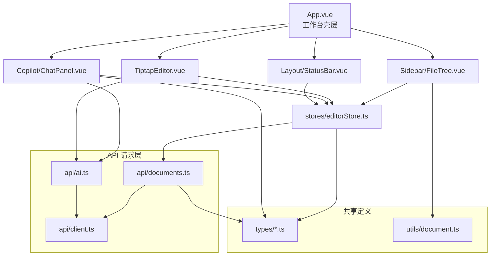

# Frontend目录与代码规范

## 1. 调整结论

本轮 `frontend` 的整理目标不是“继续在旧结构上打补丁”，而是把状态、请求、类型和视图边界重新拉清楚，同时保持当前前端界面和功能不缺失。

这次已经完成的关键动作：

- 完全删除前端 Docker/Nginx 链路，只保留 Vite 开发与构建方式。
- 把 API 调用、共享类型、文档格式化工具从大组件和大 store 里抽离出来。
- 删除重复声明文件 `src/env.d.ts`，只保留 `src/vite-env.d.ts`。
- 删除未接入代码 `src/utils/date.ts`，并把日期显示收敛到统一工具函数。
- 修复编辑器内容更新的重复链路，避免同一份内容在组件和 store 中双写。
- 删除已证实未使用的依赖，保持 `package.json` 与 `package-lock.json` 一致。

## 2. 当前目录总览

```text
frontend/
  index.html
  package.json
  package-lock.json
  postcss.config.js
  tailwind.config.js
  tsconfig.json
  tsconfig.node.json
  vite.config.ts
  src/
    api/
      ai.ts                  # AI 对话、补全请求封装
      client.ts              # Axios 实例与统一报错处理
      documents.ts           # 文档相关请求
    components/
      Copilot/
        ChatPanel.vue        # 右侧 AI 面板
      Editor/
        TiptapEditor.vue     # 富文本编辑器与补全逻辑
      Layout/
        StatusBar.vue        # 底部状态栏
      Sidebar/
        FileTree.vue         # 左侧文档列表
      modals/
        ConfirmModal.vue     # 删除确认弹窗
    stores/
      editorStore.ts         # 全局编辑状态、自动保存、面板开关
    types/
      chat.ts                # 聊天相关类型
      document.ts            # 文档与保存状态类型
    utils/
      document.ts            # 标题归一化、时间显示格式化
    App.vue                  # 工作台壳层
    main.ts                  # Vue 启动入口
    style.css                # 全局样式与编辑器样式修正
    vite-env.d.ts            # Vite 类型声明
```

## 3. 页面、状态与请求流



## 4. 各层职责与限制

| 层级 | 位置 | 主要职责 | 限制 |
|---|---|---|---|
| 壳层 | `src/App.vue` | 组织三栏布局、标题输入、全局快捷键 | 不直接发 HTTP 请求 |
| 状态层 | `src/stores/editorStore.ts` | 文档加载、保存调度、UI 开关、状态汇总 | 不内嵌 Axios 细节 |
| 请求层 | `src/api/*.ts` | 与后端接口通信、统一错误处理 | 不持有组件状态 |
| 类型层 | `src/types/*.ts` | 文档与聊天的共享类型定义 | 不放运行逻辑 |
| 工具层 | `src/utils/document.ts` | 标题归一化、时间格式化 | 不触发副作用 |
| 侧边栏 | `src/components/Sidebar/FileTree.vue` | 文档列表展示、创建、删除入口 | 不自己维护文档源数据 |
| 编辑器 | `src/components/Editor/TiptapEditor.vue` | Tiptap 渲染、幽灵补全、Markdown 粘贴处理 | 不直接保存文档 |
| AI 面板 | `src/components/Copilot/ChatPanel.vue` | 聊天发送、RAG 模式切换、引用跳转 | 不直接管理文档列表 |
| 状态栏 | `src/components/Layout/StatusBar.vue` | 字数、光标位置、AI 状态展示 | 不自己计算编辑器内容 |

## 5. 这次为什么要这样拆

### 5.1 Store 不再直接背所有脏活

原来的 `editorStore.ts` 同时承担了：

- 类型定义
- API 请求
- 自动保存防抖
- UI 状态
- 文档标题兼容修补

这会导致读者一进 store 就必须跨过太多概念。所以现在拆成：

- `types/document.ts`：只放文档结构与保存状态类型
- `api/documents.ts`：只管文档请求
- `utils/document.ts`：只管标题和时间格式化
- `stores/editorStore.ts`：只负责把请求、状态和 UI 编排起来

### 5.2 编辑器不再重复写内容

原来的编辑器既 `emit('update:modelValue')`，又直接调用 `store.updateContent()`，同一份 Markdown 会走两次状态链路。这类代码最容易把“加载文档”和“用户输入”混成一团。

现在改成：

- 编辑器只在用户真实输入时向外 `emit`
- `App.vue` 通过 `@update:model-value` 把内容交给 store
- store 统一负责脏状态和自动保存

这样界面不变，但数据链路只有一条。

### 5.3 不保留前端没用上的假结构

当前前端并没有实际消费 folder 树，也没有多模块页面路由。所以这次不为了“看起来完整”去硬拆出一层 folder feature 或页面路由层。结构必须服务现有代码，而不是服务想象中的未来。

## 6. 目录与命名规则

后续继续整理前端时，建议遵守这些边界：

- 组件文件只放视图与交互，不把后端请求写进模板组件里。
- 能跨组件复用的请求函数，统一放进 `src/api/`。
- 能跨组件复用的类型，统一放进 `src/types/`。
- 只有纯格式化、归一化逻辑才能进 `src/utils/`。
- 类型声明文件只保留一份 `src/vite-env.d.ts`，不要重复放 `env.d.ts`。
- 在前端真正接入 folders、routes、settings 页面之前，不新增空壳目录。

## 7. 当前验证方式

本轮整理后，已经执行：

```bash
cd /root/Velo/frontend
npm run build
```

结果：构建通过。

说明当前界面主结构、文档编辑、自动保存链路、AI 面板和状态栏都仍然处于可构建状态。

## 8. 当前推荐理解方式

可以把现在的前端理解成 4 个同级关注面：

- 工作台壳层：`App.vue`
- 业务状态层：`stores/editorStore.ts`
- 请求与共享定义层：`api/`、`types/`、`utils/`
- 叶子组件层：`components/`

只要继续沿着这个边界演进，文件数量不会虚胖，读者也不用在“视图、请求、状态、兼容补丁”之间来回跳。 
