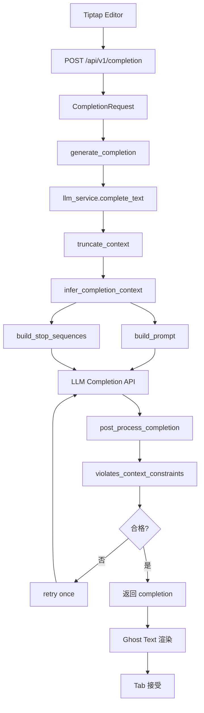

# 补全模块链路图与研究设计说明

## 1. 问题定义

本系统中的补全功能不是通用对话生成，而是一个更窄、更严格的任务:

- 输入: 光标前文 `prefix`、光标后文 `suffix`、文档语言 `language`、触发模式 `trigger_mode`
- 输出: 一段应当被插入到光标处的短文本
- 目标: 在保证语义连贯的同时，尽可能避免结构漂移、模板复读、空泛套话和 Markdown 语法污染

从研究视角看，这个任务可以定义为:

`language-aware constrained infill for Chinese academic markdown writing`

也就是“面向中文学术 Markdown 写作场景的、带结构约束的中缀补全”。

## 2. 旧链路问题

旧版本链路的主要问题不是模型能力不足，而是系统没有把“生成”与“约束”分离:

- 前端已经发送 `language: markdown`，但后端没有真正利用该信息。
- Prompt 是统一模板，没有根据段落、列表、标题、引用等上下文状态切换约束。
- 后处理只有“去重”和“空泛词过滤”，没有结构校验。
- 模型一旦进入高概率模板，就会产生固定引导句复读，例如“还包括：”“如下：”。

因此，旧系统更像“提示词驱动的开放生成”，而不是“约束驱动的受限补全”。

## 3. 新链路总览

### 3.1 系统链路图



### 3.2 分层架构图

```text
前端触发层
  -> 决定何时触发补全、传递 prefix/suffix/language/trigger_mode

API 接口层
  -> 参数校验、日志记录、服务调度

策略层 completion_policy
  -> 上下文分类
  -> Prompt 构建
  -> Stop 设计
  -> 结构约束
  -> 后验校验

生成层 llm_service
  -> 模型请求
  -> 有限次重试
  -> 返回最优候选

交互呈现层
  -> ghost text
  -> Tab 接受 / Esc 取消
```

### 3.3 标准化补全参数

为兼顾“补文质量”和“交互延迟”，补全链路不再使用随场景漂移的临时窗口，而是固化为两档配置:

| 模式 | 前端/后端上下文窗口 | Prompt 窗口 | 最大输出 tokens | 最大输出字符 |
|---|---|---|---|---|
| `auto` | `prefix=512`，`suffix=96` | `prompt_prefix=288`，`prompt_suffix=72` | `20` | `24` |
| `manual` | `prefix=896`，`suffix=160` | `prompt_prefix=512`，`prompt_suffix=96` | `28` | `56` |

这样设计的原因是:

- 自动补全强调即时性，所以窗口更短、输出更短，只负责给出“下一小步”
- 手动补全强调可用性，所以给更长上下文和更宽输出上限，允许生成更完整的短语或短句
- 前端裁剪窗口与后端策略窗口统一，避免两端各自截断导致的上下文失真
- 输出长度同时受 `max_tokens` 和 `max_chars` 双重限制，降低模型超长展开对延迟和结构稳定性的影响

## 4. 每层的限制与作用

| 层级 | 位置 | 作用 | 主要限制 |
|---|---|---|---|
| 前端触发层 | `frontend/src/components/Editor/TiptapEditor.vue` | 控制何时发起补全 | 只在空选区触发；自动补全仅在尾部触发；已做首轮上下文窗口裁剪 |
| API 层 | `backend/app/api/completion.py` | 参数校验与日志记录 | 空 `prefix` 直接返回空字符串；只接受结构化输入 |
| 上下文分类层 | `backend/app/services/ai/completion_policy.py` | 判断当前是段落、列表项、标题还是引用 | 使用可解释规则，不依赖模型猜测 |
| Prompt 约束层 | `backend/app/services/ai/completion_policy.py` | 根据上下文生成差异化提示词 | 明确禁止不符合状态的 Markdown 结构 |
| 解码约束层 | `backend/app/services/ai/completion_policy.py` | 控制 stop 和输出长度 | 强制单行输出；限制最大字符数；动态阻断 suffix echo |
| 后处理层 | `backend/app/services/ai/completion_policy.py` | 清洗模型输出 | 去掉 prefix overlap、suffix overlap、冗余空白 |
| 审核层 | `backend/app/services/ai/completion_policy.py` | 判定候选是否合法 | 拒绝列表漂移、引导句、复读、悬空冒号、纯标点输出 |
| 生成编排层 | `backend/app/services/ai/llm_service.py` | 负责调用模型与重试 | 最多两次尝试；不再承载业务规则 |

## 5. 策略层的核心思想

### 5.1 上下文状态分类

当前系统将补全场景划分为 5 类状态:

- `plain_text`: 非 Markdown 纯文本环境
- `paragraph`: Markdown 正文段落
- `list_item_body`: 列表项正文
- `heading_text`: 标题文本
- `quote_body`: 引用正文

这个设计可以理解为一个轻量级状态机:

```text
输入 prefix 当前行
  -> 匹配列表标记? 是 => list_item_body
  -> 匹配标题标记? 是 => heading_text
  -> 匹配引用标记? 是 => quote_body
  -> markdown 且非以上? => paragraph
  -> 否则 => plain_text
```

这样做的好处是:

- 可解释
- 可调试
- 可单元测试
- 可扩展到更多结构，如代码块、表格、公式

### 5.2 约束驱动生成

生成时不是只告诉模型“自然续写”，而是告诉模型:

- 你当前在哪个结构状态下
- 允许输出什么
- 禁止输出什么
- 给出正例和反例

这是一种典型的 `policy-conditioned generation` 思路。模型不是自由发挥，而是在策略空间内搜索候选。

### 5.3 后验确定性审核

本系统没有把“正确性”完全交给模型，而是在模型输出后增加一层确定性校验。

拒绝条件包括:

- 套话: 如“在当今社会”“具有重要意义”
- 模板引导句: 如“还包括：”“如下：”“主要有：”
- 最近行回声复读
- 未授权 Markdown 块起始: `-`、`#`、`>`、编号列表
- 段落态下以 `：` 结尾的悬空引导句
- 纯标点输出

这一步相当于把“可接受补全空间”显式化，是系统研究性的关键部分。

## 6. 为什么这不是“打补丁”

本次改造没有继续在旧函数上堆 if/else，而是做了职责重组:

- `completion.py` 只负责接口层
- `llm_service.py` 只负责模型请求与重试
- `completion_policy.py` 统一管理策略、状态分类、Prompt、stop、后处理、审核

因此，这次改造是“架构拆分”，不是“规则堆叠”。

可以把它概括为:

`Prompt rules are no longer scattered across the stack; they are centralized into a policy layer.`

## 7. 可用于论文/答辩的学术表述

### 7.1 研究问题

在中文 Markdown 文档写作场景中，如何在保持语义连贯的同时，降低大模型补全产生的结构漂移、模板复读与无关引导句问题？

### 7.2 方法概括

本文提出一种面向中文 Markdown 写作的分层补全框架。该框架首先基于光标邻域对上下文状态进行分类，然后根据状态生成差异化约束提示，进一步通过 stop 序列和长度限制约束模型解码，最后使用确定性规则进行后验审核和拒绝重试，从而实现“生成能力”和“结构正确性”的解耦。

### 7.3 创新点总结

- 将补全任务建模为“带结构约束的中缀生成”，而不是普通续写。
- 引入轻量上下文状态机，提高补全文本与 Markdown 结构的一致性。
- 引入确定性后验审核机制，显式控制可接受输出空间。
- 构建了可解释、可测试、可扩展的策略层，而非纯 prompt engineering。

## 8. 可扩展方向

如果继续做毕业设计深化，可以增加以下研究内容:

- 引入更细粒度状态，如代码块、表格、公式环境
- 将规则层抽象为可切换 `policy profile`
- 加入基于真实用户接受行为的在线反馈学习
- 对比不同模型在相同策略层下的结构稳定性差异
- 将后验规则扩展为有限状态自动机或 CFG 约束

## 9. 结论

这套补全模块的价值不只是“能用”，而是体现出一种较完整的工程研究思路:

- 先形式化问题
- 再拆分系统职责
- 再设计约束机制
- 再通过测试与端到端验证保证闭环

对于毕设和复试来说，这种“把系统从 prompt 技巧提升为可解释的分层架构”的叙述，会明显比“我调了很多提示词”更有研究性。
