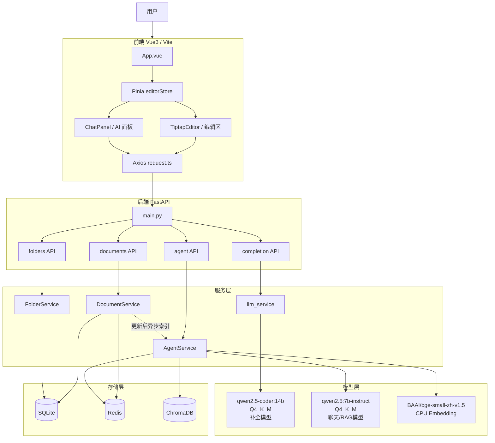

# 当前架构图

```mermaid
flowchart TB
    User[用户]

    subgraph Frontend[前端 Vue3 / Vite]
        App[App.vue]
        Store[Pinia editorStore]
        Editor[TiptapEditor / 编辑区]
        Copilot[ChatPanel / AI 面板]
        HTTP[Axios request.ts]
    end

    subgraph Backend[后端 FastAPI]
        Main[main.py]
        DocsAPI[documents API]
        FolderAPI[folders API]
        AgentAPI[agent API]
        CompletionAPI[completion API]
    end

    subgraph Services[服务层]
        DocSvc[DocumentService]
        FolderSvc[FolderService]
        AgentSvc[AgentService]
        LLMSvc[llm_service]
    end

    subgraph Storage[存储层]
        DB[(SQLite)]
        Redis[(Redis)]
        Chroma[(ChromaDB)]
    end

    subgraph Models[模型层]
        Coder[qwen2.5-coder:14b\nQ4_K_M\n补全模型]
        Chat[qwen2.5:7b-instruct\nQ4_K_M\n聊天/RAG模型]
        Embed[BAAI/bge-small-zh-v1.5\nCPU Embedding]
    end

    User --> Frontend
    App --> Store
    Store --> Editor
    Store --> Copilot
    Editor --> HTTP
    Copilot --> HTTP
    HTTP --> Main

    Main --> DocsAPI
    Main --> FolderAPI
    Main --> AgentAPI
    Main --> CompletionAPI

    DocsAPI --> DocSvc
    FolderAPI --> FolderSvc
    AgentAPI --> AgentSvc
    CompletionAPI --> LLMSvc

    DocSvc --> DB
    DocSvc --> Redis
    DocSvc -. 更新后异步索引 .-> AgentSvc

    FolderSvc --> DB

    AgentSvc --> Redis
    AgentSvc --> Chroma
    AgentSvc --> Chat
    AgentSvc --> Embed

    LLMSvc --> Coder
```
