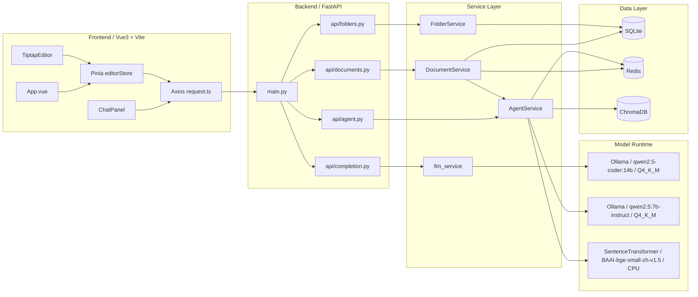

# 当前架构说明

## 总览

Velo 当前是一个 **前后端分离 + 本机 Ollama 双模型 + 本地向量检索** 的架构。

核心目标分成三条链路：

1. **文档编辑链路**：前端编辑器 + 后端文档 CRUD + SQLite/Redis
2. **AI 补全链路**：前端编辑器触发补全，后端调用 `qwen2.5-coder:14b`
3. **AI 对话 / RAG 链路**：Copilot 面板调用后端 Agent，后端使用 `qwen2.5:7b-instruct`，可选走 Chroma 检索

其中 embedding 目前走 **CPU 本地模型** `BAAI/bge-small-zh-v1.5`，不依赖 Ollama。

---

## 一、架构图



---

## 二、各层职责

### 1. 前端层

前端入口是 `frontend/src/App.vue`，它把界面拆成三个核心区域：

- 左侧文件树
- 中间 Tiptap 编辑器
- 右侧 AI Copilot 面板

关键文件：

- `frontend/src/App.vue`
- `frontend/src/stores/editorStore.ts`
- `frontend/src/components/Editor/TiptapEditor.vue`
- `frontend/src/components/Copilot/ChatPanel.vue`
- `frontend/src/api/request.ts`

前端职责：

- 文档列表加载、创建、删除、保存
- 编辑器内容变更与自动保存
- 发起聊天请求 / RAG 请求
- 发起代码补全请求

其中 `editorStore.ts` 是前端状态中心：

- `documents`：文档列表
- `currentDocument`：当前文档
- `saveStatus`：保存状态
- `isCopilotOpen`：AI 面板开关

---

### 2. API 层

后端入口是 `backend/app/main.py`，统一挂载 API 路由。

路由汇总在 `backend/app/api/api.py`。

当前主要接口分成四类：

#### 文档接口
- `backend/app/api/documents.py`
- 负责文档 CRUD

#### 文件夹接口
- `backend/app/api/folders.py`
- 负责目录树和目录内容查询

#### Agent 接口
- `backend/app/api/agent.py`
- 负责 AI 对话、RAG、润色、续写

#### 补全接口
- `backend/app/api/completion.py`
- 负责编辑器的 Ghost Text / inline completion

API 层职责很薄，主要做：

- 请求参数接收
- 依赖注入
- 调用 Service
- 返回标准响应

---

## 三、核心业务链路

### 1. 文档编辑与保存链路

流程：

1. 用户在前端编辑器输入内容
2. `editorStore.updateContent()` 更新本地状态
3. 通过防抖调用 `saveCurrentDocument()`
4. 前端发请求到文档接口
5. `DocumentService` 更新 SQLite 中的文档
6. 清理 Redis 文档列表缓存
7. 如果内容变化，后台触发重新索引

关键点：

- SQLite 是主存储
- Redis 只做列表缓存，不是主数据源
- 文档详情默认直接查库，保证编辑实时性

涉及文件：

- `frontend/src/stores/editorStore.ts`
- `backend/app/services/document_service.py`
- `backend/app/models.py`
- `backend/app/database.py`

---

### 2. AI 补全链路

这是当前编辑体验里最敏感的一条链路。

流程：

1. 前端编辑器在光标位置收集 `prefix` / `suffix`
2. 调用补全接口
3. `backend/app/api/completion.py` 接收请求
4. `backend/app/services/llm_service.py` 构造 prompt
5. 后端调用 Ollama OpenAI 兼容接口 `/completions`
6. 模型使用 `qwen2.5-coder:14b`
7. 返回补全文本给前端作为 inline suggestion

当前设计特征：

- 前文/后文裁剪，降低延迟
- 有重复前缀去重逻辑
- 返回第一段短补全，避免拖沓
- 补全模型和聊天模型明确分离

模型：

- `COMPLETION_MODEL=qwen2.5-coder:14b`
- 本机确认量化格式：`Q4_K_M`

涉及文件：

- `frontend/src/components/Editor.vue`
- `backend/app/api/completion.py`
- `backend/app/services/llm_service.py`
- `backend/app/core/config.py`

---

### 3. AI 对话 / RAG 链路

流程分两种。

#### 普通聊天

1. 前端 Copilot 发消息
2. `POST /agent/chat`
3. `AgentService` 调用聊天模型
4. 返回文本结果

#### RAG 问答

1. 前端开启知识库模式
2. `POST /agent/chat` 并附带 `use_rag=true`
3. `AgentService` 用 embedding 模型把 query 向量化
4. 在 ChromaDB 做相似度检索
5. 拼接检索到的上下文
6. 调用聊天模型生成回答
7. 返回答案 + sources

当前模型分工：

- 聊天 / RAG：`qwen2.5:7b-instruct`
- embedding：`BAAI/bge-small-zh-v1.5`（CPU）

涉及文件：

- `backend/app/api/agent.py`
- `backend/app/services/agent_service.py`
- `backend/app/core/config.py`

---

## 四、数据层说明

### 1. SQLite

当前本机开发模式下，数据库走 SQLite：

- 路径由 `DATA_DIR` 控制
- 默认库文件：`backend/data/wiki.db`

用途：

- 文档表
- 文件夹表
- 系统日志表

### 2. Redis

用途：

- 文档列表缓存
- RAG 响应缓存

如果 Redis 不可用，系统部分功能可能退化，但主链路仍以数据库为准。

### 3. ChromaDB

用途：

- 文档向量索引
- RAG 检索

文档在创建/更新后会异步切分并写入 Chroma。

---

## 五、模型运行时说明

当前是 **双模型拆分架构**：

### 补全模型
- 模型名：`qwen2.5-coder:14b`
- 用途：编辑器代码/文本补全
- 量化：`Q4_K_M`
- 特点：更适合 completion 场景

### 聊天模型
- 模型名：`qwen2.5:7b-instruct`
- 用途：对话、润色、续写、RAG
- 量化：`Q4_K_M`
- 特点：更轻，更适合作为常规问答模型

### Embedding 模型
- 模型名：`BAAI/bge-small-zh-v1.5`
- 运行方式：SentenceTransformer + CPU
- 用途：文档向量化与 query 检索

这样拆分的好处：

- 补全和对话的模型目标不同，不互相干扰
- 14B 只承担补全，不让 RAG/聊天把它拖慢
- 7B 负责日常问答，资源占用更低

---

## 六、当前实际状态

### 已确认

1. 本机 Ollama 已安装
2. 已存在两个模型：
   - `qwen2.5-coder:14b`
   - `qwen2.5:7b-instruct`
3. 两个模型当前都已经是量化版
   - `quantization = Q4_K_M`

### 运行验证结果

我实际尝试启动时发现两处环境问题：

1. **后端启动失败**
   - 原因：需要在 `backend/` 目录下启动，否则 `app.main:app` 无法导入 `app`
2. **前端第一次启动失败**
   - 原因：第一次是在项目根目录执行了 `npm run dev`，根目录没有 `package.json`

这说明当前代码架构本身没有直接证明模型配置错误，主要是启动命令的工作目录要求需要严格遵守。

---

## 七、建议的标准启动方式

### 后端

```bash
cd /root/Velo/backend
DATA_DIR=/root/Velo/backend/data \
POSTGRES_SERVER=sqlite \
LLM_PROVIDER=ollama \
LLM_BASE_URL=http://localhost:11434/v1 \
COMPLETION_MODEL=qwen2.5-coder:14b \
CHAT_MODEL=qwen2.5:7b-instruct \
EMBEDDING_PROVIDER=huggingface \
EMBEDDING_MODEL=BAAI/bge-small-zh-v1.5 \
OPENAI_API_KEY=ollama \
/root/Velo/.venv/bin/python -m uvicorn app.main:app --host 127.0.0.1 --port 8000
```

### 前端

```bash
cd /root/Velo/frontend
npm run dev -- --host 127.0.0.1 --port 5173
```

---

## 八、当前架构里的明显问题

### 1. 前端 API 封装和后端接口并不完全一致

例如 `frontend/src/api/index.ts` 里：

- `chatWithAgent()` 走的是 `/agent/rag_chat` 或 `/agent/chat`
- 但后端实际公开的是 `POST /agent/chat`

另外请求体结构也和后端 `ChatRequest` 不完全一致。

这说明前端存在一部分旧接口残留，需要清理或统一。

### 2. 存在两套聊天面板实现

- `frontend/src/components/CopilotPanel.vue`
- `frontend/src/components/Copilot/ChatPanel.vue`

真正被 `App.vue` 使用的是 `ChatPanel.vue`，另一套更像旧版本残留。

### 3. 编辑器也存在两套思路

- `frontend/src/components/Editor.vue`：Monaco + inline completion
- `frontend/src/components/Editor/TiptapEditor.vue`：当前主编辑器

如果当前主界面已经切到 Tiptap，那么补全能力挂载位置需要再次确认，否则容易出现“后端补全存在，但当前编辑器路径没走到”的问题。

---

## 九、一句话总结

Velo 当前已经演变成一个 **Vue3 + FastAPI + SQLite + Redis + Chroma + Ollama 双模型** 的本机知识写作系统：

- 文档数据走 SQLite
- 文档列表和部分 RAG 结果走 Redis 缓存
- RAG 检索走 ChromaDB
- 补全走 `qwen2.5-coder:14b (Q4_K_M)`
- 对话/RAG走 `qwen2.5:7b-instruct (Q4_K_M)`
- embedding 走 CPU 的 `BAAI/bge-small-zh-v1.5`

从架构上看，模型分层已经比较清晰；当前更需要解决的是 **前端旧实现残留、接口不统一、以及启动方式标准化**。
